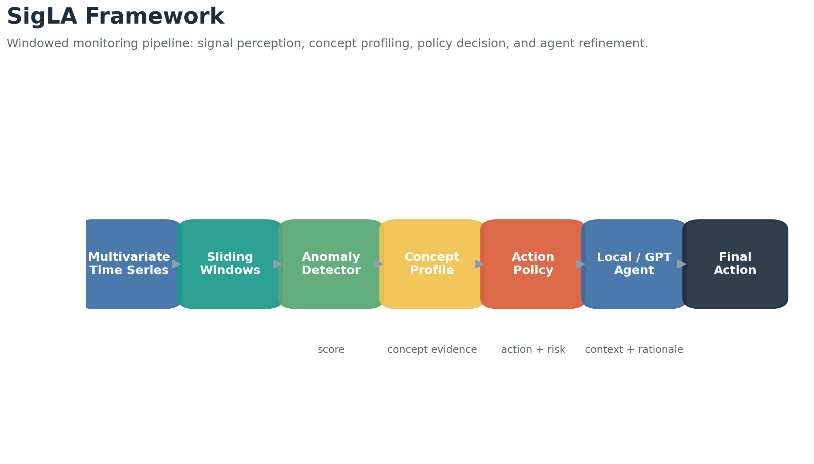
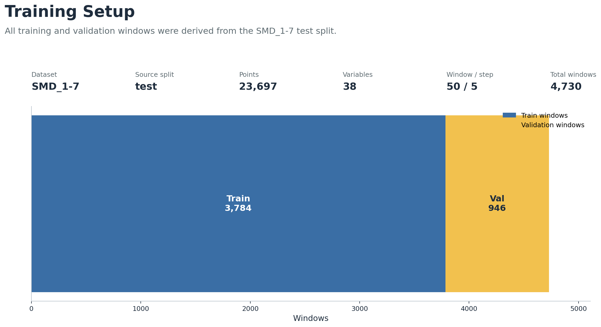
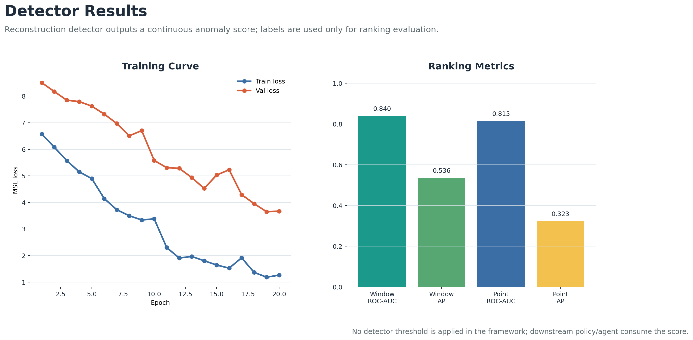
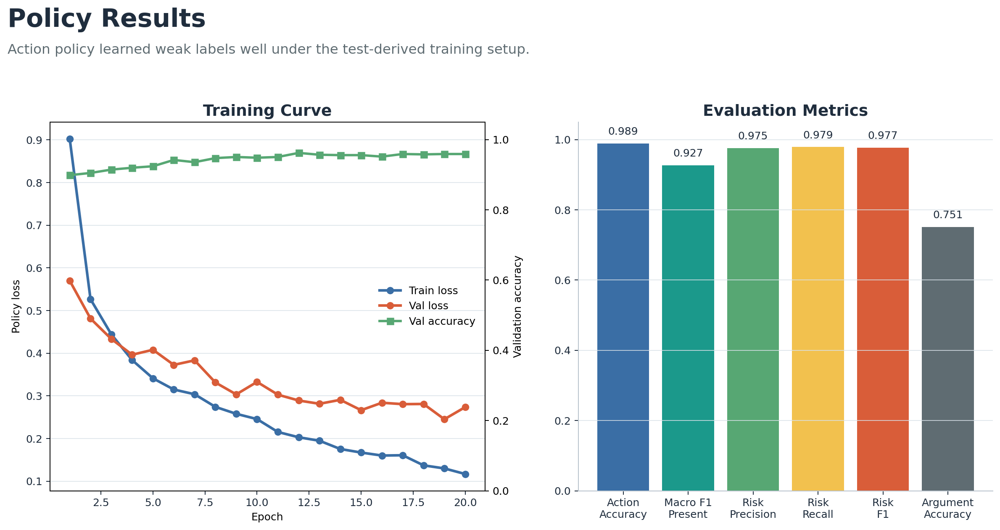
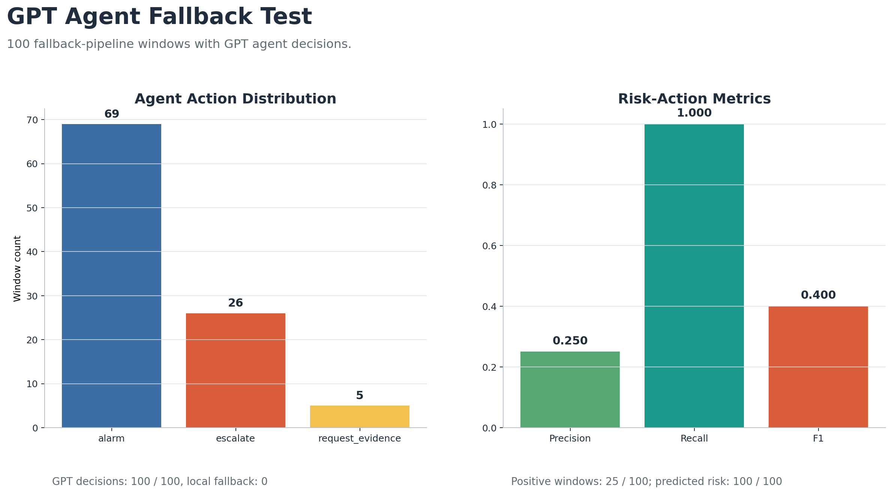
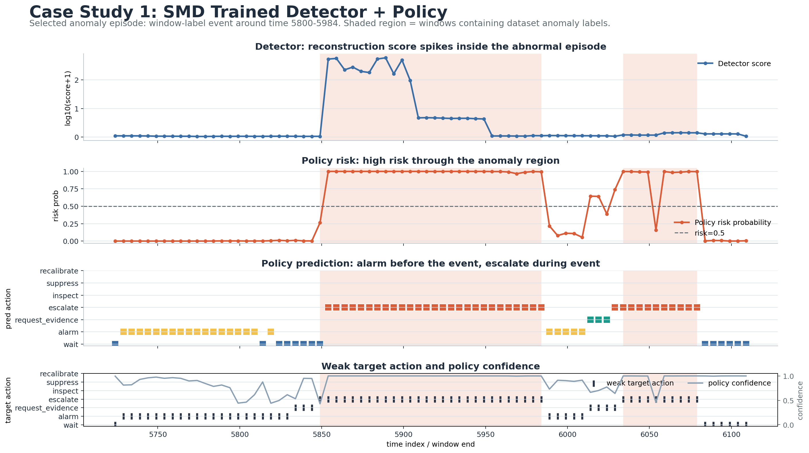
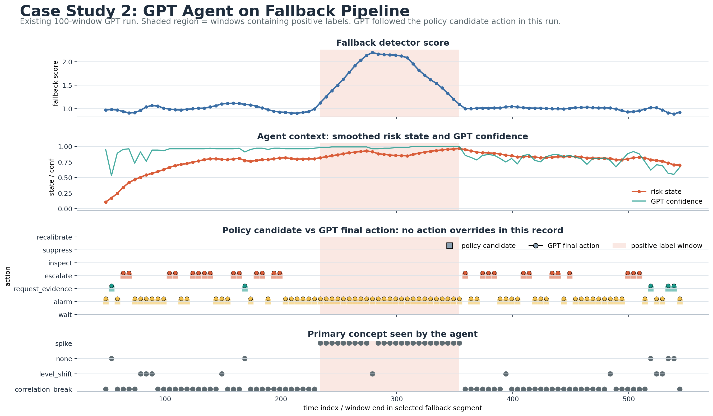

# SigLA Experiment Slide Report

## Slide 1: What We Did

- Updated the training logic to match the current SigLA framework.
- Trained two new models on `SMD_1-7`:
  - `MLPAnomalyDetector`
  - `MLPActionPolicy`
- Training windows were built from the dataset `test` split.
- Tested the GPT agent behavior on a fallback pipeline sample.

## Slide 2: Framework Structure



```text
Multivariate time series
  -> sliding windows
  -> anomaly detector
  -> concept profile
  -> action policy
  -> local / GPT agent
  -> final monitoring action
```

Core components:

- Detector: reconstructs each window and produces anomaly scores.
- Concept profile: summarizes signal evidence such as spike, level shift, and correlation break.
- Policy: predicts action, argument, and risk.
- Agent: receives policy output plus context and returns the final decision.

## Slide 3: Training Setup



Dataset:

- `SMD_1-7`
- Variables: `38`
- Source split: `test`
- Test points: `23,697`
- Window size: `50`
- Step: `5`
- Total windows: `4,730`
- Train windows: `3,784`
- Validation windows: `946`

Training:

- Detector epochs: `20`
- Policy epochs: `20`
- Device: `A100 GPU`
- Training jobs completed successfully with Slurm.

## Slide 4: Detector Model



Model:

- `MLPAnomalyDetector`
- Objective: reconstruct input windows.
- Score: reconstruction error.

Result:

| Metric | Value |
|---|---:|
| Best validation loss | `3.6507` |
| Window ROC-AUC | `0.8401` |
| Window average precision | `0.5357` |
| Point ROC-AUC | `0.8149` |
| Point average precision | `0.3232` |

Observation:

- The detector is treated as a continuous anomaly score provider.
- Dataset labels are used only to evaluate score ranking, not to force a detector threshold.

## Slide 5: Policy Model



Model:

- `MLPActionPolicy`
- Inputs: signal window, score sequence, concept profile.
- Outputs: action type, action argument, risk score.

Result:

| Metric | Value |
|---|---:|
| Best validation loss | `0.2453` |
| Final validation accuracy | `0.9588` |
| Test action accuracy | `0.9888` |
| Macro F1 on present actions | `0.9268` |
| Risk precision | `0.9754` |
| Risk recall | `0.9786` |
| Risk F1 | `0.9770` |
| Argument accuracy | `0.7507` |

Observation:

- The policy learned the weak action labels well.
- Risk classification is strong under this train/test-from-test experimental setup.

## Slide 6: GPT Agent Test



Agent setup:

- Model: `gpt-5.4-mini`
- Pipeline mode: fallback pipeline
- Dataset: synthetic sample
- Windows tested: `100`
- GPT calls completed: `100 / 100`
- Local fallback calls: `0`

Agent action distribution:

| Action | Count |
|---|---:|
| `alarm` | `69` |
| `escalate` | `26` |
| `request_evidence` | `5` |

Risk-action metrics:

| Metric | Value |
|---|---:|
| Precision | `0.2500` |
| Recall | `1.0000` |
| F1 | `0.4000` |

Observation:

- GPT successfully returned valid decisions for all 100 windows.
- In this fallback test, GPT followed the policy candidate action every time.
- The fallback policy marked all 100 windows as risk actions, so recall was high but precision was low.

## Slide 7: Main Takeaways

- The current training pipeline now follows the detector -> concept -> policy -> agent framework.
- The policy model performs well on weak action labels from the SMD test split.
- The detector should feed continuous reconstruction scores into the policy/agent instead of making a hard anomaly decision.
- The GPT agent is operational and stable, but current prompt/context mostly makes it explain the policy rather than revise it.

## Slide 8: Case Study - Trained Detector + Policy



This selected SMD anomaly episode shows:

- Detector reconstruction error spikes inside the labeled abnormal window.
- Policy risk rises before and during the abnormal window.
- Policy predicts `alarm` before the event and `escalate` during the event.

## Slide 9: Case Study - GPT Agent



This selected fallback-agent record shows:

- GPT decisions were returned successfully for every window.
- GPT followed the candidate policy action in this run.
- The fallback policy was aggressive, so the agent preserved high recall but also many false positives.

## Slide 10: Limitations / Next Steps

Limitations:

- Current training uses windows derived from the `test` split, so the numbers should be treated as framework validation, not final benchmark results.
- Current training uses overlapping windows from the `test` split, so score ranking should be treated as framework validation.
- GPT agent was tested on fallback synthetic windows, not the newly trained SMD models.

Next steps:

- Calibrate how the policy/agent consume detector scores.
- Run the GPT agent on SMD windows using the trained detector and policy.
- Add richer agent context so GPT can meaningfully override or refine policy actions.
- Separate final benchmark evaluation from the test-derived training experiment.

## Output Paths

- Detector run: `/u/ylin30/sigLA/code/runs/detector_SMD_1-7_test_w50_s5`
- Policy run: `/u/ylin30/sigLA/code/runs/policy_SMD_1-7_test_w50_s5`
- GPT fallback agent test: `/u/ylin30/sigLA/code/runs/fallback_pipeline_gpt_test`
- Case study figures: `/u/ylin30/sigLA/case_studies`
