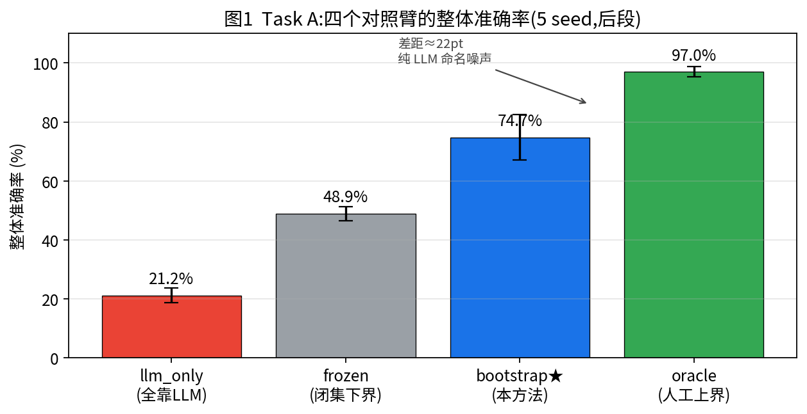
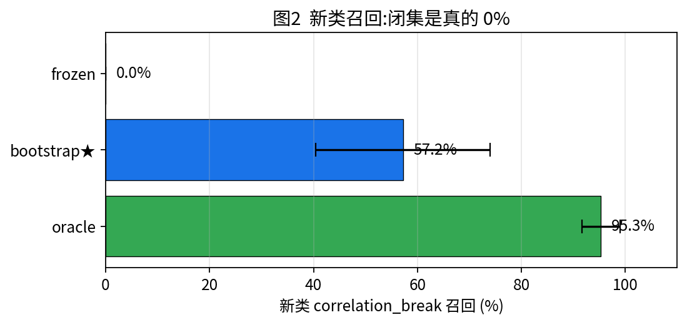
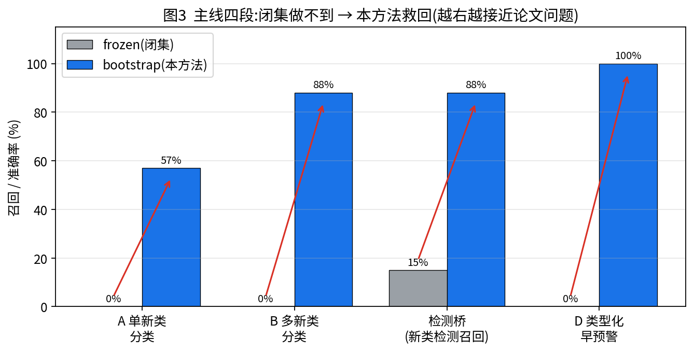
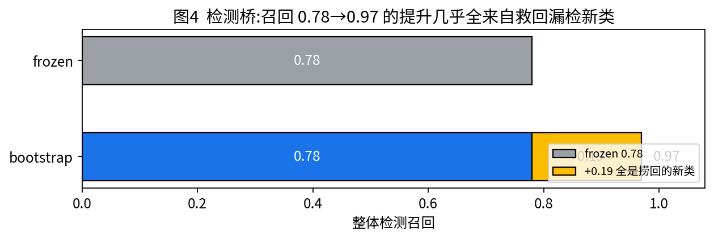
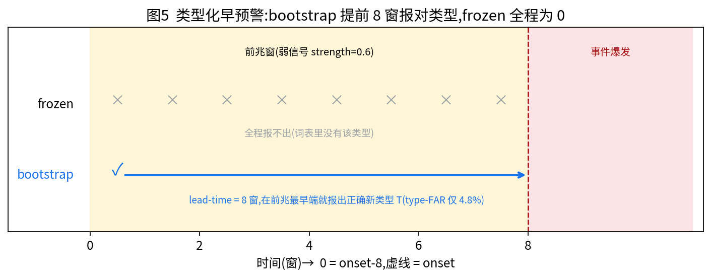
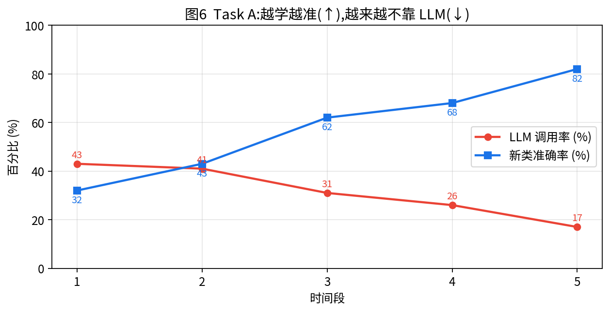

# SigLA 周进展汇报

## 一句话结论
本周完成方法转向与四段实证闭环:从「前期校准决策 / 抗漂移」路线收尾,转入主线
**「LLM 自举的开放词表持续学习」**,并干净地把它落到论文要回答的真实问题——
**对从未见过的异常类型做检测与前兆早预警**。

---

## 本周主线进展

### 1. 前期路线收尾
- decider 决策器价值经实验确认:**真实但幅度有限**。
- 在线抗漂移自适应**单独不足以**解决问题。
- 据此决定转向开放词表持续学习作为主贡献。

### 2. Task A — 单新类开放词表分类闭环
闭环成立:证据门控发现新类 → LLM 命名 → 扩词表(grow head)→ 类平衡在线重训,**全程无人工标注**。

5 seed + 双对照臂(后段=新类涌现后):

| 臂 | 整体准确率 | 新类 correlation_break | 标注成本 |
|---|---|---|---|
| frozen(闭集下界) | 48.9% ± 2.4% | 0.0% | 0 |
| **bootstrap(本方法)** | **74.7% ± 7.7%** | **57.2% ± 16.8%** | LLM 31.4%(43%→17% 衰减) |
| oracle(人工上界) | 97.0% ± 1.7% | 95.3% ± 3.7% | 人工 24.5% |
| llm_only(逐窗分类) | 21.2% ± 2.5% | — | 100% |

- 与上界差距(~22pt)**纯来自 LLM 标注噪声**,方法天花板高。
- 逐窗 LLM 直接分类仅 21% — 不是好分类器。
- 关键发现:"列举全部取非已知"命名优于 top-1 prompt(57% vs 29%)。

### 3. Task B — 多新类涌现(06-17)
- 打破 multi-type blocker:根因是**证据不正交**(trend↔level_shift、variance_burst↔spike/oscillation 纠缠误触已知签名)。
- 新建正交基准 `sigla_exp/ovbench.py`,使**每概念恰好且仅触发自己的签名**;命名喂 z-score 而非原始值。

3 新类错峰涌现,5 seed:

| | frozen | bootstrap |
|---|---|---|
| 全段(3 新类活跃) | 50.6% ± 4.8% | **88.1% ± 2.9%** |
| variance_burst | 0% | 67% ± 2% |
| trend | 0% | **100% ± 0%** |
| correlation_break | 0% | 56% ± 11% |

词表 100% 长全(3→6),warm-up 期无提前建类。

### 4. 检测桥(route B bridge,06-17d)
回答审稿人核心问题:开放词表对**检测**(而非仅分类)有用吗?

| 指标(涌现后,5 seed) | frozen | bootstrap |
|---|---|---|
| 新类检测召回(argmax≠normal) | 15% ± 30%(4/5 seed=0%) | **88% ± 6%** |
| 整体检测 F1 | 0.82 ± 0.06 | 0.87 ± 0.03 |
| 整体检测召回 | 0.78 ± 0.08 | **0.97 ± 0.02** |

- 闭集检测器把新类 correlation_break **自信判成 normal → 完全漏检**。
- 本方法把新类检测召回从 ~0% 救回 88%,整体召回 0.78→0.97。

### 5. 类型化前兆早预警(D,06-18)
把闭环接到论文真正的「问题」:前兆窗内**报出正确的新异常类型**。

| | frozen | bootstrap |
|---|---|---|
| 类型化早预警 recall | **0% ± 0%** | **100% ± 0%** |
| lead-time(窗) | — | **8.0**(满前兆窗宽) |
| 类型 FAR(正常被判 T) | 0.0% | **4.8%**(受控) |

- frozen 永远命名不出新类型;bootstrap 提前 8 窗报出正确新类型,**全程无标注**。

---

## 诚实 caveat(已记录,非阻塞)
- correlation_break 最弱最抖(56% ± 11%);variance_burst 命名 64%。
- 在线重训侵蚀**二分类** score 校准(boot 二分类 FAR 38%);**类型化口径不受影响**。
- "frozen 类型化 EW=0" 部分 by construction,价值在于 lead-time + 无标注自举 + 低 type-FAR 的端到端演示。

---

## 下一步
- 文献定位:与 LLM-as-labeler / novel-class-detection / open-vocab AD 的差异点。
- 多 novel × 多 seed 扩展;加强 correlation_break / variance_burst 签名判别度与注入强度。
- 把类型化早预警接到二分类检测端到端。

---

## 图表
> 由 `scripts/make_weekly_figs.py` 生成;合并版 PDF:[weekly_report_figs.pdf](figs/weekly_report_figs.pdf)

**图1 Task A 四个对照臂(下界→本方法→上界,成本对照)**

**图2 新类召回:闭集真的是 0%**

**图3 主线四段:闭集做不到 → 本方法救回**

**图4 检测桥:整体召回 0.78→0.97 几乎全来自救回漏检新类**

**图5 类型化早预警:bootstrap 提前 8 窗报对类型,frozen 全程为 0**

**图6 越学越准、越来越不靠 LLM**

